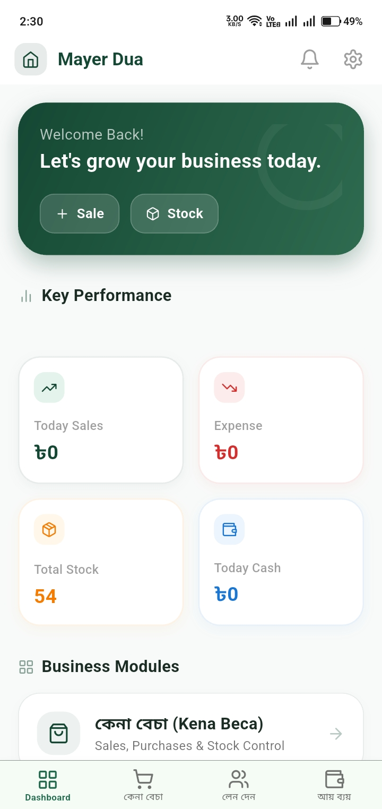

# 🌿 Papyrus Web Hub

Papyrus Web Hub is the central command center for the Papyrus ecosystem. It serves as both the public-facing landing page for the platform and a secure, multi-architecture distribution hub for the Papyrus mobile application.



## 🚀 Features

### 🌐 Public Landing Page
- **Premium Design**: Built with Next.js 15, Tailwind CSS, and Framer Motion for a state-of-the-art landing experience.
- **Conversion Focused**: Clear CTA for downloading the latest APK with architecture detection.
- **Brand Aligned**: Seamlessly integrates official Papyrus iconography and wordmarks.

### 🔐 Sudo Administrative Suite
A secure, custom-built dashboard accessible via the `/sudo` namespace.
- **Live Activity Monitoring**: Real-time platform growth tracking (Total Shops, Members, and Activity).
- **Multi-Architecture APK Management**: 
    - Support for Optimized builds (ARMv7, ARM64, x86_64).
    - Remote binary hosting (GitHub/External) for Universal APKs over 50MB.
    - Version lifecycle management (Soft/Force updates).

### 🛠️ Intelligent Distribution API
- **Auto-Detection**: Dedicated API endpoint that identifies client device architecture and serves the most optimized binary.
- **Supabase Powered**: High-performance backend using PostgreSQL and Supabase Storage.

## 💻 Tech Stack
- **Framework**: [Next.js 15+](https://nextjs.org/) (App Router)
- **Styling**: [Tailwind CSS v4](https://tailwindcss.com/)
- **Backend**: [Supabase](https://supabase.com/)
- **Icons**: [Lucide React](https://lucide.dev/)
- **Deployment**: [Netlify](https://www.netlify.com/)

## 🛠️ Setup & Local Development

1. **Clone the repository**:
   ```bash
   git clone https://github.com/arnobx86/PapyrusWebsite.git
   ```

2. **Install dependencies**:
   ```bash
   npm install
   ```

3. **Configure Environment Variables**:
   Create a `.env.local` file:
   ```env
   NEXT_PUBLIC_SUPABASE_URL=your_project_url
   NEXT_PUBLIC_SUPABASE_ANON_KEY=your_anon_key
   ADMIN_PASSWORD=your_secure_password
   ```

4. **Run the development server**:
   ```bash
   npm run dev
   ```

## 📦 Deployment

This project is optimized for **Netlify**.
- **Build Command**: `npm run build`
- **Publish Directory**: `.next`
- **Node Version**: 20+

## 📄 License
Copyright © 2026 Papyrus Team. All rights reserved.
